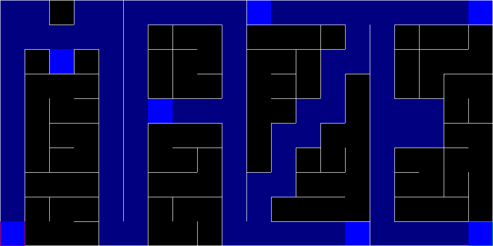

# Projet Maze

## Description

Le projet Maze est une application en C++ conçue pour générer, résoudre, vérifier et visualiser des labyrinthes. Il
propose plusieurs algorithmes de génération, de résolution et de vérification, ainsi que des fonctionnalités
interactives pour explorer les labyrinthes.

Ce projet est développé dans le cadre de la formation CMI OPTIM et regroupe trois fichiers principaux :

1. `maze_generator.out` : Génère des labyrinthes.
2. `maze.out` : Résout, vérifie et joue dans des labyrinthes.



## Sommaire

1. [Description](#description)
2. [Structure du Projet](#structure-du-projet)
3. [Prérequis](#prérequis)
4. [Compilation](#compilation)
5. [Utilisation](#utilisation)
6. [Codes d'Erreur](#codes-derreur)
7. [Exemples Complets](#exemples-complets)
8. [Auteurs](#auteurs)
9. [Liens Utiles](#liens-utiles)

## Structure du Projet

```
maze_project/
├── doc/                           # Documentation du projet
│   ├── README.md                  # Présentation générale
│   └── rapport.pdf                # Document technique complet
├── src/                           # Code source
│   ├── main.cpp                   # Fichier principal du résolveur, vérificateur et joueur
│   ├── maze_generator.cpp         # Fichier principal du générateur
│   └── instances/                 # Exemples de labyrinthes
│   └── lib/                       # Bibliothèques
│       ├── cell.hpp               # Classe de cellule
│       ├── maze.hpp               # Classe de labyrinthe
│       ├── queue.hpp              # Classe de file
│       ├── rand.hpp               # Classe de génération de nombres aléatoires
│       ├── reader.hpp             # Lecture de fichiers
│       ├── show.hpp               # Affichage graphique
│       ├── stack.hpp              # Classe de pile
│       ├── var.hpp                # Variables globales
│       ├── wall.hpp               # Classe de mur
│       ├── writer.hpp             # Écriture de fichiers
│       └── algo/                  # Algorithmes de génération
│           ├── back_tracking.hpp  # Algorithme de backtracking
│           ├── diagonal.hpp       # Algorithme diagonal
│           ├── fractal.hpp        # Algorithme fractal
│           └── wall_maker.hpp     # Algorithme wall maker
│       └── checker/               # Algorithmes de vérification
│           ├── breadth_first.hpp  # Algorithme de largeur
│           └── depth_first.hpp    # Algorithme de profondeur
│       └── game/                  # Jeux et visites interactives
│           ├── fog.hpp            # Visite avec brouillard
│           ├── fog_hand.hpp       # Visite avec brouillard à la main
│           ├── tom_thumb_hand.hpp # Visite en marchant le chemin à la main
│           ├── walk.hpp           # Jeu de marche
│       └── solver/                # Algorithmes de résolution
│           ├── breadth_first.hpp  # Algorithme de largeur
│           └── depth_first.hpp    # Algorithme de profondeur
└── CMakeLists.txt                 # Fichier de compilation
└── README.md                      # Fichier de présentation
```

## Prérequis

Pour utiliser ce projet, vous devez avoir les outils suivants installés sur votre système :

### Logiciels Nécessaires

- **Compilateur C++** (g++ ou clang++)
- **CMake** (système de compilation)
- **SFML** (bibliothèque graphique)
- **Make** (système de build)

### Installation

#### Sur Debian/Ubuntu :

```bash
sudo apt-get update
sudo apt-get install -y g++ cmake make libsfml-dev
```

#### Sur Fedora :

```bash
sudo dnf install -y gcc-c++ cmake make SFML
```

#### Sur Arch Linux :

```bash
sudo pacman -S gcc cmake make sfml
```

#### Sur NixOS :

```bash
nix-shell -p gcc cmake make sfml
```

#### Sur macOS (avec Homebrew) :

```bash
brew install gcc cmake make sfml
```

#### Sur Windows (avec MSYS2) :

```bash
pacman -S gcc-c++ cmake make sfml
```

## Compilation

Pour compiler le projet, suivez ces étapes :

1. Générez les fichiers Makefile :
   ```bash
   cmake .
   ```

2. Compilez le projet :
   ```bash
   make
   ```

## Utilisation

Ce projet comporte deux exécutables principaux :

1. `maze_generator.out` : Génère des labyrinthes avec différents algorithmes.
2. `maze.out` : Résout, vérifie et joue dans des labyrinthes.

### Commandes Générales

#### Afficher l'aide :

```bash
./maze_generator.out --help
./maze_generator.out -h
./maze.out --help
./maze.out -h
```

#### Charger un labyrinthe :

```bash
./maze.out --input fichier_maze.txt
./maze.out -i fichier_maze.txt
```

#### Sauvegarder un labyrinthe :

```bash
./maze_generator.out --output fichier_maze.txt
./maze_generator.out -o fichier_maze.txt
```

#### Effacer un labyrinthe :

```bash
./maze.out --input fichier_maze.txt --clear --input fichier_maze_aux.txt
./maze.out -i fichier_maze.txt -c -i fichier_maze_aux.txt
```

#### Effacer le cache d'un labyrinthe :

```bash
./maze.out --input fichier_maze.txt --clear-maze
./maze.out --input fichier_maze.txt -cm
```

#### Afficher le labyrinthe :

```bash
./maze.out --input fichier_maze.txt --show
./maze.out -i fichier_maze.txt -s
```

##### Paramètres de l'Affichage

* `-s` ou `--show` : Active l'affichage graphique.
* `-f` ou `--framerate` `<fps>` : Spécifie le framerate de l'affichage. (Par défaut : 60 fps).
* `-ds` ou `--delay-show` `<ms>` : Spécifie le délai d'affichage. (Par défaut : 0 ms).
* `-lf` ou `--low-frequency` : Active la fréquence d'affichage basse.

Il est possible de définir les valeurs suivantes dans le fichier `.env` :

```dotenv
 FRAMERATE=60
 DELAY_SHOW=0.0
 LOW_FREQUENCY=false
```

###### Paramètres de Couleur

Les couleurs utilisées dans l'affichage du labyrinthe peuvent être personnalisées via le fichier `.env`. Les paramètres
disponibles sont :

* `MAZE_WALL_COLOR=255,255,255` : Couleur des murs du labyrinthe. (par défaut : Blanc)
* `MAZE_WALL_START_COLOR=255,0,0` : Couleur de la cellule de départ. (par défaut : Rouge)
* `MAZE_WALL_END_COLOR=0,255,0` : Couleur de la cellule d'arrivée. (par défaut : Vert)
* `MAZE_STATUS_IDLE_COLOR=0,0,0` : Couleur des cellules non visitées. (par défaut : Noir)
* `MAZE_STATUS_VISITED_COLOR=0,0,128` : Couleur des cellules visitées. (par défaut : Blue)
* `MAZE_STATUS_HOPELESS_COLOR=0,0,255` : Couleur des cellules sans issue. (par défaut : Jaune)
* `MAZE_STATUS_TOO_MANY_NEIGHBORS_COLOR=128,128,0` : Couleur des cellules trop connectées. (par défaut : Cyan)
* `MAZE_STATUS_WAY_OUT_COLOR=0,128,0` : Couleur du chemin de sortie. (par défaut : Vert Clair)
* `MAZE_STATUS_CURRENT_COLOR=125,0,0` : Couleur de la cellule actuelle. (par défaut : Rouge Foncé)

#### Contrôles de l'Affichage

L'affichage graphique propose les contrôles suivants :

- **Echap** : Ferme l'affichage.
- **Espace** : Met en pause le programme.
- **D** : Rafraîchit toutes les cellules.
- **R** : Réinitialise les paramètres d'affichage.
- **L** : Inverse la fréquence d'affichage (haute/basse).
- **+** : Augmente le framerate.
- **-** : Diminue le framerate.
- \* Augmente le délai d'affichage.
- **/** : Diminue le délai d'affichage.
- **Clic gauche + déplacement souris** : Déplace la vue du labyrinthe (valable pour les labyrinthes inférieurs à
  100x100).
- **Molette de la souris** : Zoom avant/arrière. (valable pour les labyrinthes inférieurs à 100x100).

#### Paramètres du Joueur

* `-ps` ou `--player-start` `<x> <y>` : Spécifie la position de départ du joueur dans le labyrinthe (Valeurs négatives
  sont relatives à la fin du labyrinthe, valeurs flottantes utilisées comme pourcentage). (Par défaut : aléatoire).
* `-pe` ou `--player-end` `<x> <y>` : Spécifie la position d'arrivée du joueur dans le labyrinthe (Valeurs négatives
  sont relatives à la fin du labyrinthe, valeurs flottantes utilisées comme pourcentage). (Par défaut : aléatoire).

### Fonctionnalités Spécifiques

#### Générateur de Labyrinthes (`maze_generator.out`)

**Syntaxe de base** :

```bash
./maze_generator.out [OPTIONS]
```

**Options** :

| Option                 | Description                                               | Exemple                    |
|------------------------|-----------------------------------------------------------|----------------------------|
| `-g, --generate`       | Génère un labyrinthe par défaut.                          | `./maze_generator.out -g`  |
| `-gs, --generate-show` | Génère et affiche le labyrinthe.                          | `./maze_generator.out -gs` |
| `-a, --algorithm`      | Spécifie l'algorithme de génération.                      | `-a bt` ou `-a wall_maker` |
| `-d, --dimension`      | Spécifie les dimensions (largeur x hauteur).              | `-d 20 20`                 |
| `-i, --imperfect`      | Génère un labyrinthe imparfait.                           | `-i`                       |
| `-p, --probability`    | Spécifie la probabilité de suppression de murs (0.0-1.0). | `-p 0.1`                   |

**Algorithmes de Génération** :

- `back_tracking` (bt) : Algorithme de backtracking. (par défaut)
- `wall_maker` (wm) : Algorithme wall maker.
- `diagonal` (d) : Algorithme de génération en diagonale.
- `fractal` (f) : Algorithme fractal.

**Exemples** :

1. Générer un labyrinthe de 15x15 avec l'algorithme backtracking :
   ```bash
   ./maze_generator.out -g -d 15 15 -a bt
   ```

2. Générer un labyrinthe imparfait de 20x20 avec une probabilité de 10% :
   ```bash
   ./maze_generator.out -g -d 20 20 -i -p 0.1
   ```

#### Résolveur de Labyrinthes (`maze.out`)

**Syntaxe de base** :

```bash
./maze.out [OPTIONS]
```

**Options** :

| Option                | Description                          | Exemple                      |
|-----------------------|--------------------------------------|------------------------------|
| `-r, --resolve`       | Résout le labyrinthe chargé.         | `./maze.out -i maze.txt -r`  |
| `-rs, --resolve-show` | Résout et affiche le processus.      | `./maze.out -i maze.txt -rs` |
| `-a, --algorithm`     | Spécifie l'algorithme de résolution. | `-a dfl` ou `-a bf`          |

**Algorithmes de Résolution** :

- `depth_first_left` (dfl) : Algorithme de profondeur (par défaut).
- `depth_first_right` (dfr) : Version droite de l'algorithme de profondeur.
- `breadth_first` (bf) : Algorithme de largeur.

**Exemples** :

1. Résoudre un labyrinthe avec l'algorithme depth_first_left :
   ```bash
   ./maze.out -i maze.txt -r -a dfl
   ```

2. Résoudre et visualiser le processus :
   ```bash
   ./maze.out -i maze.txt -rs -a bf
   ```

#### Vérification de Labyrinthes (`maze.out`)

**Syntaxe de base** :

```bash
./maze.out [OPTIONS]
```

**Options** :

| Option               | Description                            | Exemple                      |
|----------------------|----------------------------------------|------------------------------|
| `-v, --verify`       | Vérifie si le labyrinthe est valide.   | `./maze.out -i maze.txt -v`  |
| `-vs, --verify-show` | Vérifie et affiche le processus.       | `./maze.out -i maze.txt -vs` |
| `-a, --algorithm`    | Spécifie l'algorithme de vérification. | `-a dfl` ou `-a bf`          |
| `-p, --perfect`      | Vérifie si le labyrinthe est parfait.  | `-p`                         |

**Algorithmes de Vérification** :

- `depth_first_left` (dfl) : Algorithme de profondeur (par défaut).
- `depth_first_right` (dfr) : Version droite de l'algorithme de profondeur.
- `breadth_first` (bf) : Algorithme de largeur.

**Exemples** :

1. Vérifier si un labyrinthe est parfait :
   ```bash
   ./maze.out -i maze.txt -v -p -a dfl
   ```

2. Vérifier et visualiser le processus :
   ```bash
   ./maze.out -i maze.txt -vs -a bf
   ```

#### Jeu et visite de Labyrinthes (`maze.out`)

**Syntaxe de base** :

```bash
./maze.out [OPTIONS]
```

**Options** :

| Option             | Description                                         | Exemple                      |
|--------------------|-----------------------------------------------------|------------------------------|
| `-g, --game`       | Lance un jeu ou une visite dans le labyrinthe.      | `./maze.out -i maze.txt -g`  |
| `-gs, --game-show` | Lance un jeu ou une visite et affiche le processus. | `./maze.out -i maze.txt -gs` |
| `-t, --type`       | Spécifie le type de jeu ou de la visite.            | `-t f` ou `-t w`             |

**Types de Jeu ou de visite** :

- `fog` (f) : Visite avec brouillard. (par défaut)
- `fog_right` (fr) : Brouillard à droite.
- `fog_left` (fl) : Brouillard à gauche.
- `tom_thumb` (tt) : Marche le chemin.
- `tom_thumb_right` (ttr) : Marque le chemin à droite.
- `tom_thumb_left` (ttl) : Marque le chemin à gauche.
- `walk` (w) : Marche normale. (nécessite l'activation de show)
- `walk_ghost` (wg) : Marche sans visibilité. (nécessite l'activation de show)

**Exemples** :

1. Jouer avec le type `fog` :
   ```bash
   ./maze.out -i maze.txt -g -t f
   ```

2. Jouer et visualiser le processus :
   ```bash
   ./maze.out -i maze.txt -gs -t w
   ```

## Codes d'Erreur

| Code | Description                          |
|------|--------------------------------------|
| 0    | Aucune erreur                        |
| 1    | Erreur dans les arguments            |
| 2    | Erreur de fichier (lecture/écriture) |
| 3    | Erreur d'affichage                   |

## Exemples Complets

### Génération et Résolution

```bash
# Étape 1 : Générer un labyrinthe de 20x20 avec l'algorithme backtracking
./maze_generator.out -g -d 20 20 -a bt -o mon_labyrinthe.txt

# Étape 2 : Résoudre le labyrinthe généré
./maze.out -i mon_labyrinthe.txt -r -a dfl

# Étape 3 : Vérifier si le labyrinthe est parfait
./maze.out -i mon_labyrinthe.txt -v -p -a bf
```

### Jeu et Visite

```bash
# Lancez le jeu avec le type de jeu par défaut (fog)
./maze.out -i mon_labyrinthe.txt -g -t f
```

## Auteurs

- **Arnaud Aloyse** : [GitHub](https://github.com/aloyse33)
- **Facca Ethan** : [GitHub](https://github.com/untypequicode)
- **Glasson Lucien** : [GitHub](https://github.com/lulu-froid)

## Liens Utiles

- **Rapport de Projet** : [Rapport PDF](doc/rapport.pdf)
- **Documentation Technique** : [Documentation](doc/README.md)
- **Repository GitHub** : [Lien GitHub](https://github.com/Universite-de-Bordeaux/maze)